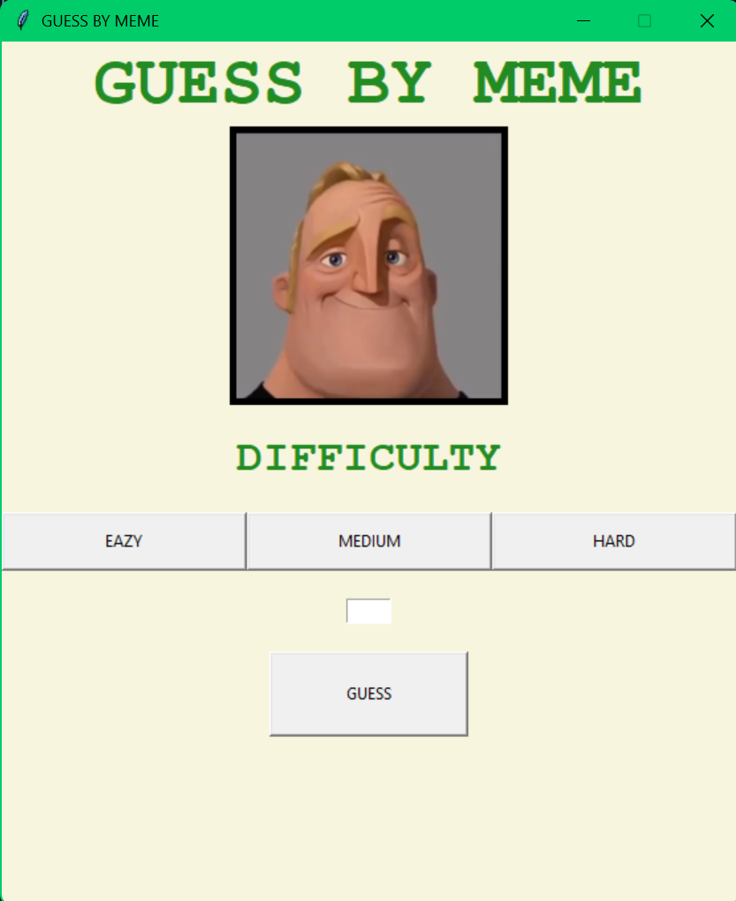

# 🎮 GUESS BY MEME

**Guess by Meme** is a fun and interactive number guessing game built with Python using Tkinter and Pygame. What makes this game unique is that your progress and proximity to the correct answer are humorously illustrated by changing meme faces — adding a fun visual twist to the classic guessing game.



---

## 📦 Features

- 🧠 **Three Difficulty Levels**: Choose from EAZY (0-10), MEDIUM (0-100), and HARD (0-1000).
- 🖼️ **Meme Reaction Feedback**: Each guess changes the face on the screen based on how close your guess is to the correct number.
- 🔊 **Sound Effects**: Fun sound effects for winning, losing, and proximity to the correct answer.
- 🎨 **Simple UI**: Built using Tkinter with clear buttons and labels.
- 💡 **Educational**: Great for kids and beginners to learn about numbers, logic, and a bit of Python programming.

---

## 🛠️ Tech Stack

- **Python**
- **Tkinter** – for GUI
- **Pygame** – for sound playback
- **Meme Images** – changes based on your guess

---

## 🚀 How to Run

1. **Clone the repository**

```bash
git clone https://github.com/MSayour/guess-by-meme.git
cd guess-by-meme
```

2. **Install requirements**

```bash
pip install pygame
```

3. **Run the game**

```bash
python main.py
```

> Make sure the `img/` and `sound/` folders are in the same directory as `main.py`.

---

## 📁 Project Structure

```
guess-by-meme/
│
├── img/                # Meme images used in the game
│   ├── start.png
│   ├── win.png
│   ├── close1.png
│   ├── close2.png
│   ├── far1.png
│   └── far2.png
│
├── sound/              # Sound effects
│   ├── start.mp3
│   ├── win.mp3
│   ├── loss.mp3
│   ├── close1.mp3
│   ├── close2.mp3
│   ├── far1.mp3
│   └── far2.mp3
│
├── main.py             # Main Python game file
└── README.md           # This file
```
---

## 💬 Feedback

Have an idea or found a bug? Open an issue or submit a PR. Contributions are welcome!

---

## 🖼️ Credits

- Meme faces sourced from popular memes (for educational/demo use).
- Built with ❤️ by Mohamad Sayour

---
## ⚡ Note 
the **right number** is diplayed in the top left corner (same place as the icon) so you can trick your friends 😂
